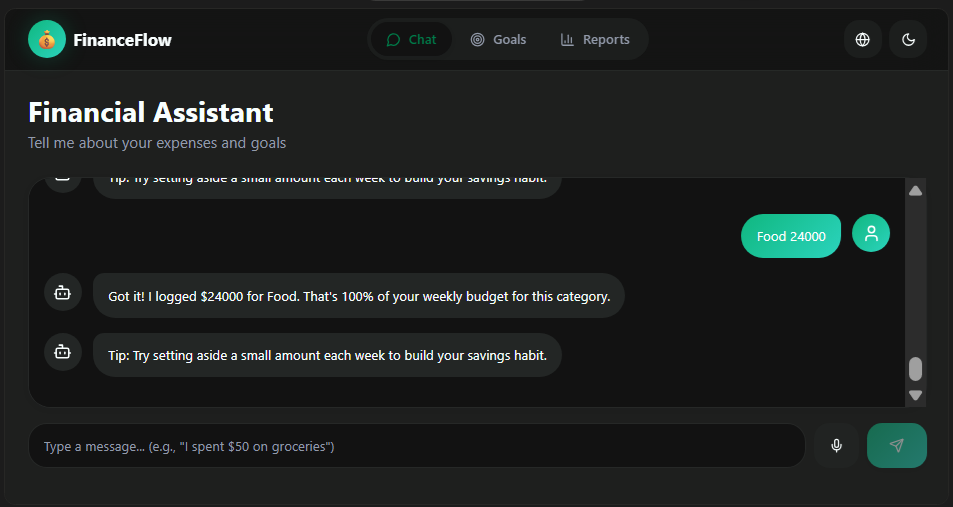
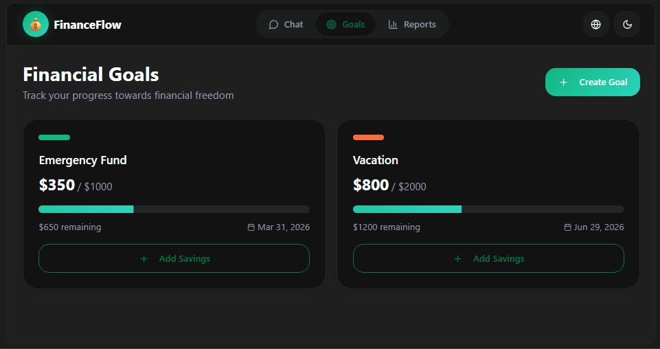
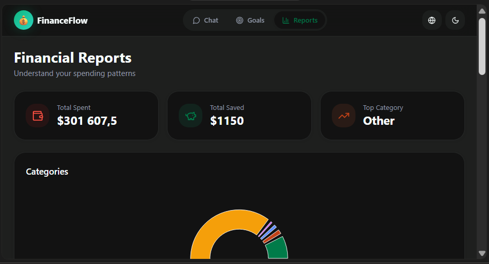
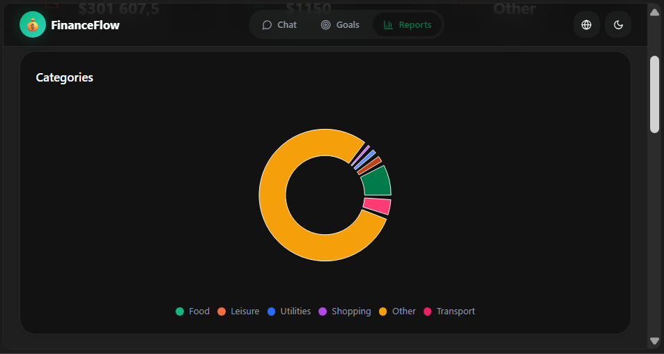
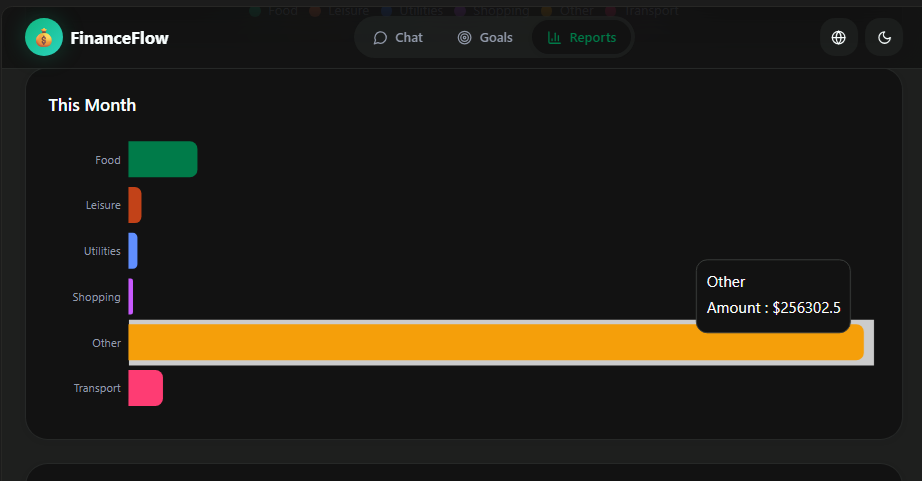
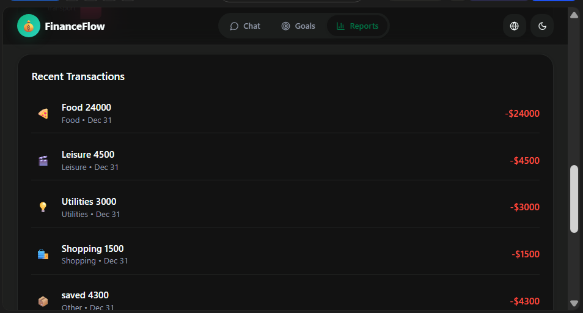
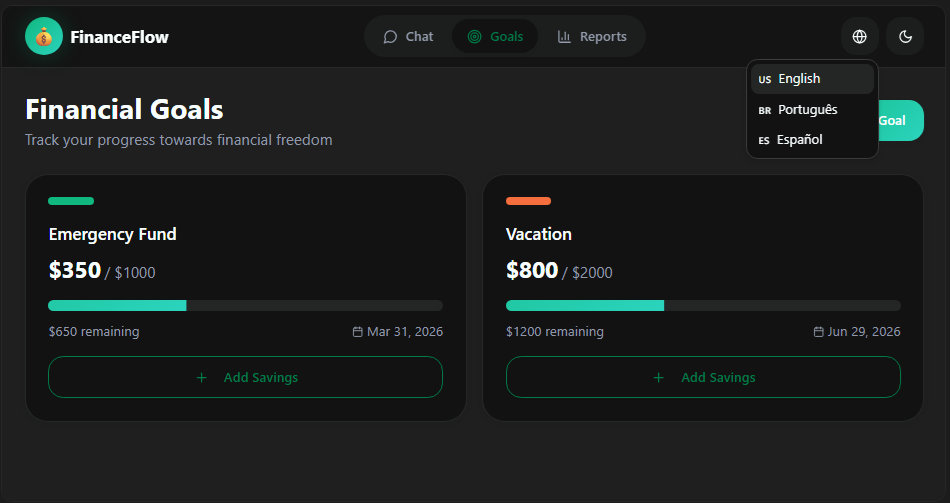
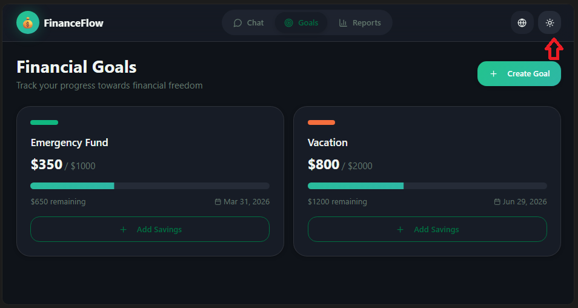

Daily learning

# Creating a Personal Finance Organization App with Vibe Coding

Project developed at the Bootcamp CAIXA - Artificial Intelligence in Practice with guidance from specialist [Venilton Falvo Jr](https://github.com/falvojr "Venilton Falvo Jr").

Learning to create the concept of a Personal Finance Organization App with AI, exploring Vibe Coding, a light and creative way to program by conversing with AI. The goal was to propose a solution to the problem of manual and tedious financial control, using AI agents capable of creating automatic savings plans and interacting through natural conversations. We developed a simplified PRD (briefing for the AI), improving the prompts in Copilot and testing Lovable to generate screen flows, MVP plans, and intelligent agents. Finally, we delivered the final prompt in the repository, containing screenshots of the interactions and a reflection on the process. More than just code, this challenge teaches you to think together with AI, transforming ideas into creative and functional solutions.

[LICENSE](/LICENSE)

See [original repository](https://github.com/digitalinnovationone/dio-lab-vibe-coding-app-financas).

---

## Refined PRD on Copilot Web

```markdown
# Product Requirements Document (PRD)
# Product: Financial Organization App with Natural Conversation
# Version: MVP
# Date: January 2026

# 1. Purpose & Vision
- The Financial Organization App aims to help users manage their personal finances through natural conversation. By combining text/voice input, automatic categorization, and personalized recommendations, the app simplifies expense tracking and goal setting. The vision is to make financial management accessible, inclusive, and educational for users across different languages and levels of financial literacy.

# 2. Target Audience
- Beginner users of financial apps
- Individuals seeking simple, conversational financial tracking
- Multilingual users (Portuguese, English, Spanish)
- Users requiring accessibility features (screen readers, voice commands, visual feedback)

# 3. Key Features
# 3.1 Chat Screen
- Natural conversation interface to log expenses and goals
- Support for text and voice input
- Visual and auditory feedback confirming entries

# 3.2 Goals Screen
- Create and track financial goals (e.g., “Save $300 by end of month”)
- Progress indicators (bars or circles)

# 3.3 Reports Screen
- Charts (pie, bar) showing expense categories
- Detailed transaction statements
- Language switch (pt-BR, en-US, es-ES)
- Display mode toggle (Light/Dark)

# 4. Technical Requirements
# 4.1 Natural Language Processing (NLP)
- Intent recognition (expenses, goals, questions)
- Multilingual support (Portuguese, English, Spanish)

# 4.2 Automatic Categorization
- Classify expenses into categories (food, transport, leisure)
- Machine learning models trained on transaction examples

# 4.3 Recommendation Engine
- Personalized saving tips based on user habits
- Rule-based suggestions with continuous learning

# 4.4 Accessibility Tools
- Screen reader compatibility
- Voice command support
- Visual feedback (contrasting colors)
- Auditory feedback (confirmation sounds)

# 5. Validation Strategy
# 5.1 Pilot Test
- 20–30 beginner users of financial apps
- Usability tests focusing on simplicity and accessibility

# 5.2 Feedback Loops
- In-app feedback collection (“I would like to suggest…”)
- Metrics: number of expenses logged, goals created, chat engagement

# 5.3 Iterative Improvements
- Adjust categorization based on reported errors
- Refine interface to reduce friction

# 6. Language & Educational Tone
- Supported languages: Portuguese (pt-BR), English (en-US), Spanish (es-ES)
- Language switch button on all screens
- Simple, educational messages:
  - “You spent $50 on groceries. That is 10% of your weekly budget.”
  - “Você gastou R$50 em supermercado. Isso representa 10% do seu orçamento semanal.”
  - “Gastaste $50 en el supermercado. Eso es el 10% de tu presupuesto semanal.”

# 7. Design Principles
# 7.1 Inclusivity
- Clear interface without information overload
- Intuitive icons and readable text

# 7.2 Accessibility
- Screen reader compatibility
- Voice navigation and simple taps

# 7.3 Feedback
- Visual alerts (colors, charts)
- Auditory alerts (soft sounds)

# 7.4 Consistency
- Uniform design patterns across screens
- Dark/Light Mode to match user preferences

# 8. Success Metrics
- Number of expenses logged per user
- Number of goals created and achieved
- Engagement with chat interface
- User satisfaction ratings from pilot test
```

---

## Interactions with Lovable

> Create a Personal Finance App based on the following PRD (Product Requirements Document): {PRD}

> I tried creating a goal called Emergency Fund, but it didn't appear in the component. It seemed like only the Financial Assistant recognized it; could you verify this? Also, where can I see the charts and statement?

> Yes (Do you want me to add a reporting screen with charts and a detailed transaction statement?)

---

## Final Result

Access the functional prototype on Lovable:  
**[financialassistantflow.lovable.app](https://financialassistantflow.lovable.app)**

## Chat



## Goals



## Reports



## Graphic Pizza



## Graphic Bar



## Transation



## Language



## Mode Dark/Light



---

## Features of the Financial Organization App

### 1. Financial Dashboard
- It provides a clear overview of personal finances:
  - **Revenues**: Total earnings recorded
  - **Expenses**: Total expenses
  - **Balance**: Difference between income and expenses
- Simple and straightforward interface for easy understanding.

### 2. Financial Assistant
- Conversational character that interacts with the user.
- It encourages linking accounts and cards for a complete view of finances.
- It offers emotional and motivational support.

### 3. Transaction Log via Chat
- Input field for the user to type messages in natural language.
- It allows you to record expenses and interact with the assistant seamlessly.

### 4. Financial Goals
- Area dedicated to creating and monitoring financial goals.
- Proactive suggestion for the user to set goals.
- Action button to add new goals.

### 5. Custom Reports
- Simple visualizations adapted to the user's style.
- Monitoring of goals and financial progress.

### 6. Universal Design
- Accessible and inclusive interface:
  - Simple language
  - Clear navigation
  - Compatibility with screen readers and voice commands.
  - Visual and auditory feedback to facilitate use.

---

## Reflection

### What worked well? 
The PRD refinement previously done in Copilot helped a lot, as the Lovable credits ran out in just 3 interactions.

### What didn't work as expected?
I was hoping to be able to interact with Lovable more often for free, but the interactions I've had so far have been enough to learn more about Vibe Coding.

### What have I learned about communicating with AIs?
I learned that it's basically the same as talking to a person: the more details and clarity you provide, the better the interaction.
